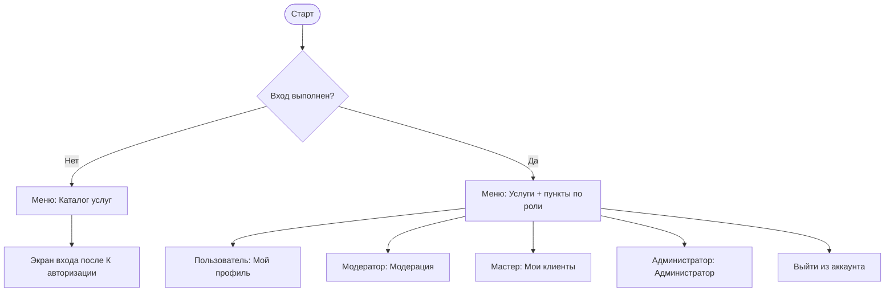
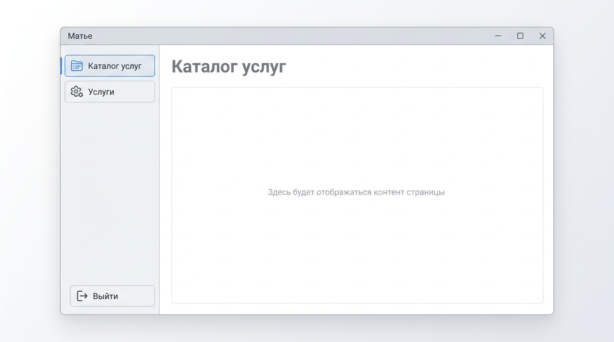
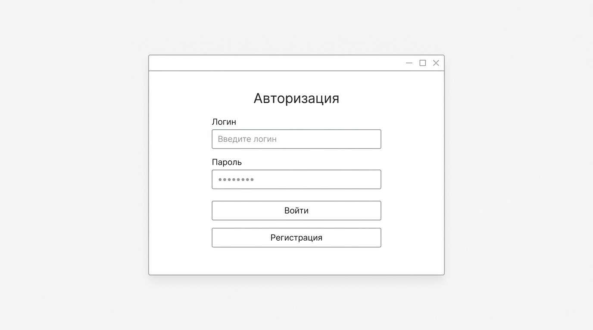
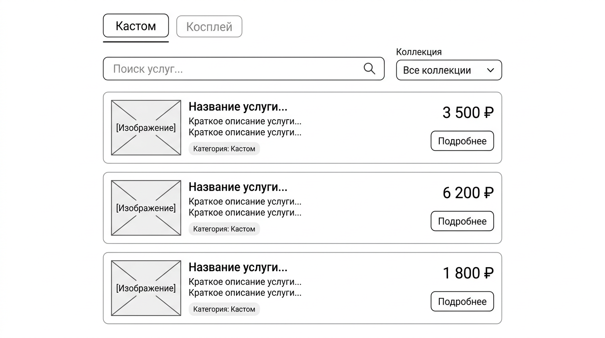
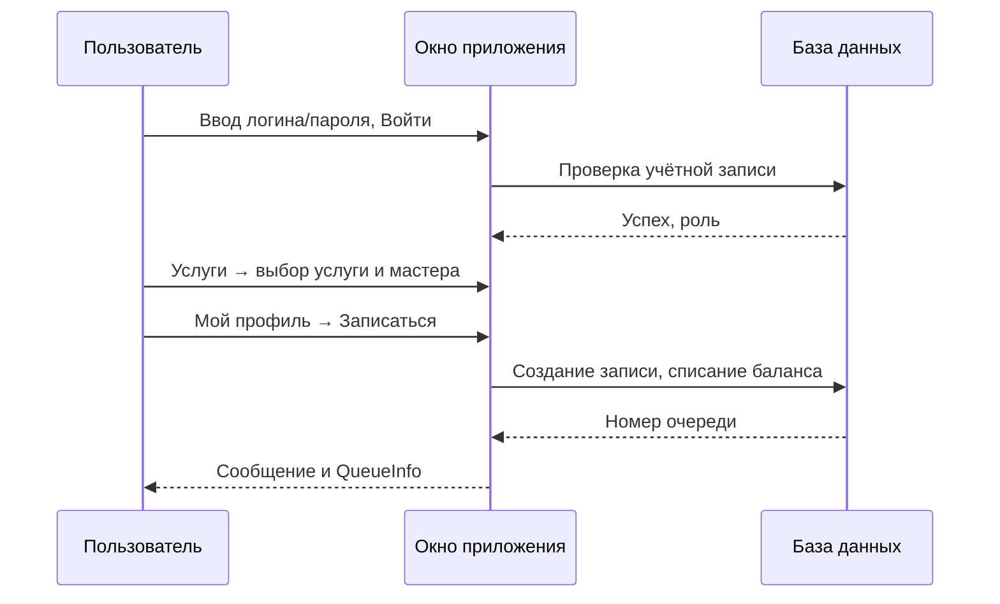

# Руководство пользователя 
## Приложение «Матье» — запись на услуги лавки

**Версия документа:** 1.0  
**Платформа:** настольное приложение Windows (Avalonia UI)

---

## 1. Общие сведения

Приложение предназначено для клиентов, мастеров, модераторов и администраторов лавки «Матье». После входа в систему доступные разделы зависят от **роли** учётной записи. Без входа можно открыть **каталог услуг** (ознакомительный просмотр).

Окно приложения: слева — **боковое меню** и логотип, справа — **область содержимого**. Вверху — полоса заголовка с названием «Матье» и кнопками сворачивания и закрытия окна.

---

## Содержание по функциям

| Раздел | Описание |
|--------|----------|
| [§ 2. Запуск, выход и навигация](#2-запуск-выход-из-приложения-и-навигация) | Первый запуск, завершение работы |
| [§ 3. Гость: каталог услуг](#3-гость-каталог-услуг-без-входа) | Просмотр услуг и коллекций без авторизации |
| [§ 4. Авторизация и регистрация](#4-авторизация-и-регистрация) | Вход, создание учётной записи |
| [§ 5. Пользователь: профиль](#5-пользователь-мой-профиль) | Баланс, пополнение, запись, очередь, отзывы, мои записи |
| [§ 6. Каталог услуг после входа](#6-каталог-услуг-после-входа) | Поиск, фильтры, пагинация |
| [§ 7. Модератор](#7-модератор-панель) | Услуги, привязка мастеров, заявки на квалификацию |
| [§ 8. Мастер](#8-мастер-панель) | Клиенты, услуги, заявка на повышение квалификации |
| [§ 9. Администратор](#9-администратор-панель) | Пользователи и сотрудники |
| [§ 10. Иллюстрации](#10-графические-иллюстрации) | Схемы и рисунки экранов |

---

## Содержание по индикации процесса

Здесь перечислено, **где и как** приложение показывает ход операции, ошибки и справочные сообщения.

| Тип индикации | Где отображается | Когда появляется |
|---------------|------------------|------------------|
| **Сообщение об ошибке (красный текст)** | Под полями на форме входа / регистрации | Неверные данные, пустые поля, ошибка БД |
| **Строка статуса операций** | Внизу экранов профиля, модератора, мастера, администратора (`StatusMessage`) | Успех или ошибка пополнения, записи, отзыва, привязки мастера, заявок и т.д. |
| **Номер в очереди (выделение)** | В блоке записи на услугу (`QueueInfo`) | После успешной записи на услугу |
| **Пустой список / подсказка** | «Мои записи», заявки модератора, др. | Нет данных (например, ещё не было записей или заявок) |
| **Информация о странице списка** | Под списком услуг (`PageInfo`, вида «1–3 из 19») | При постраничном выводе каталога |
| **Дата последнего изменения** | На карточке услуги («Изменено: …») | Для каждой услуги в каталоге |
| **Диалог подтверждения** | При нажатии «Выход» в заголовке (закрытие программы) | Запрос подтверждения выхода из приложения |
| **Неактивные элементы** | Кнопки без назначенной команды (не должно возникать в рабочей сборке) | Команда не привязана — признак ошибки конфигурации |

---

## 2. Запуск, выход из приложения и навигация

1. Запустите файл `KvalikSamira.exe` из папки сборки (например `bin\Debug\net8.0\`).
2. Убедитесь, что **PostgreSQL** запущен и доступна база `matye` (иначе при входе появится сообщение об ошибке подключения).
3. **Закрытие программы:** кнопка «Выход» внизу бокового меню или «Закрыть» в заголовке — откроется диалог; подтвердите выход.

**Навигация по ролям (схема):**

---

## 3. Гость: каталог услуг (без входа)

1. Нажмите **«Каталог услуг»** в боковом меню.
2. Используйте вкладки **«Кастом»** / **«Косплей»**, поле **«Поиск»**, список **«Коллекция»** для фильтрации.
3. Кнопки **«◀»** и **«▶»** переключают страницы списка.
4. **«← К авторизации»** возвращает к экрану входа.

Добавление и редактирование услуг в гостевом режиме **недоступны**.

---

## 4. Авторизация и регистрация

**Вход**

1. Введите **логин** и **пароль**.
2. Нажмите **«Войти»**.
3. При успехе откроется каталог услуг; в меню появятся пункты в соответствии с ролью.

**Регистрация**

1. На экране входа нажмите **«Регистрация»**.
2. Заполните обязательные поля (фамилия, имя, логин, пароль и подтверждение).
3. **«Зарегистрироваться»** — при успехе откроется снова форма входа.

**«Назад к авторизации»** — возврат с формы регистрации на вход.

---

## 5. Пользователь: «Мой профиль»

Пункт меню **«Мой профиль»** (роль «Пользователь»).

| Блок | Действия |
|------|----------|
| **Данные и баланс** | Отображаются ФИО, роль, баланс в рублях. |
| **Пополнить баланс** | Номер карты: **16 цифр** (пробелы допускаются — учитываются только цифры). Сумма — положительное число. **«Пополнить»**. |
| **Запись на услугу** | Выберите **услугу** и **мастера** из списков. **«Записаться»** — при достаточном балансе списывается цена услуги, выдаётся **номер очереди**. |
| **Мои записи** | Список ваших записей; если пусто — отображается поясняющий текст. |
| **Отзыв** | Отзыв привязан к **услуге и мастеру**, выбранным в блоке записи (мастера можно не выбирать — отзыв только об услуге). Оценка 1–5, текст, **«Отправить отзыв»**. |

Сообщения об успехе или ошибке показываются **внизу** экрана профиля.

---

## 6. Каталог услуг после входа

Пункт **«Услуги»** — доступен всем вошедшим пользователям.

- Табы **Кастом** / **Косплей**, поиск, фильтр по **коллекции**, сброс фильтра.
- **Постраничный** вывод; внизу — информация о текущем диапазоне записей.
- На карточке услуги: название, описание, цена, длительность, коллекция, строка **«Изменено: …»**.

**Модератор** дополнительно видит **«Добавить»** и **«Ред.»** для создания и изменения услуг (время последнего изменения обновляется при сохранении).

---

## 7. Модератор: панель

Пункт **«Модерация»**.

1. **Привязка мастера к услуге:** выберите услугу, мастера — **«Привязать»** / **«Отвязать»**. Список текущих мастеров обновляется при смене услуги.
2. **Заявки на повышение квалификации:** выберите строку в списке — **«Одобрить»** или **«Отклонить»**.

Статус операций — текст внизу панели. Если заявок нет — показывается пояснение.

---

## 8. Мастер: панель

Пункт **«Мои клиенты»**.

- Блоки: сведения о мастере и квалификации, **мои услуги**, **записи клиентов**.
- **Заявка на повышение:** выберите желаемый уровень в списке — **«Отправить заявку»**. Результат отображается строкой статуса внизу.

---

## 9. Администратор: панель

Пункт **«Администратор»**.

- Просмотр списка пользователей, редактирование, добавление сотрудника (новый логин, пароль, роль).
- Сообщения о результате операций — внизу панели.

---

## 10. Графические иллюстрации

Ниже — **схематичные иллюстрации** основных экранов (ориентир по компоновке интерфейса). Для отчёта можно дополнить **реальными скриншотами** из папки `docs/screenshots/` (см. `README.md` в той же папке).

### 10.1. Главное окно (меню и область контента)

### 10.2. Авторизация

### 10.3. Каталог услуг

### 10.4. Схема потока «от входа до записи» (пользователь)

---

## Обратная связь и ограничения

- Все денежные операции в учебной версии **имитация**: достаточно ввода номера карты из 16 цифр; реальной интеграции с банком нет.
- Работа приложения зависит от **доступности PostgreSQL** и корректной строки подключения (настраивается разработчиком в коде).

---

*Конец руководства пользователя.*
